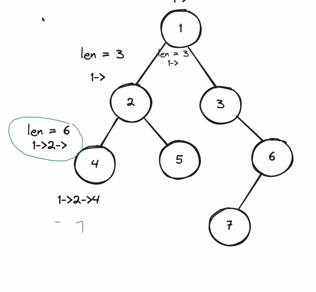

# 257. Binary Tree Paths

---


# Problem 

## Tags: 
#binary-tree, #depth-first-search, #recursion

**Link:** https://leetcode.com/problems/binary-tree-paths/description/

**Problem Text:**   
Given the root of a binary tree, return all root-to-leaf paths in any order.

A leaf is a node with no children.

Example 1:  

Input: root = [1,2,3,null,5] 
Output: ["1->2->5","1->3"]  

Example 2:  
Input: root = [1]  
Output: ["1"]  


---

# Scratch Pad/ Pseudocode

// DFS makes more sense when dealing with paths  
// keep track of path using Stringbuilder   
// go up to leaf node where node is blank  
// we neeed a helper function that recurses to make those paths  

## Ask what are the constraints:
The number of nodes in the tree is in the range [1, 100].
-100 <= Node.val <= 100

## Sub-Problem
// In this case, since we use DFS, we want to think about what we want to do with each recursion- so we don't want to add to the arrayList until we are done traversing down the path. That is we don't want to add each child to the arrayList- but rather add up all the childs of a path to a `newPathString` until we reach the end. 
// We know a path is root to leaf. 


---

# Java Solution
I <3 my wizard. Thank you for talking this through with me. Love how we got to look through it together.

## Attempt 1: StringBuilder 

```
class Solution {
    public List<String> binaryTreePaths(TreeNode root) {
      List<String>  binaryTreePath = new ArrayList <> ();

     
       StringBuilder newPathString = new StringBuilder ();
        
       dfsInOrder (root, binaryTreePath,newPathString);

return binaryTreePath;

    }


    public void dfsInOrder(TreeNode node, List<String> binaryTreePath, StringBuilder newPathString) {
               int lengthOfString = newPathString.length();

                     newPathString.append(node.val); // we appending the nodes and they have value - b/c we end recursion before the null

        if (node.left ==null && node.right == null ) {
             binaryTreePath.add (newPathString.toString());
             newPathString.setLength( lengthOfString);

            return; // exit statement to break when we reach leaf node 
        }
       
       //thing we have to do for every node 
      
        if (node.left !=null ||node.right != null)
        {
            newPathString.append("->");

        }
        if (node.left != null) {
            dfsInOrder(node.left, binaryTreePath, newPathString);
        }

        if (node.right != null) {
            dfsInOrder(node.right, binaryTreePath, newPathString);
        }
        newPathString.setLength(lengthOfString); // when left and right are done
        
    }
}
```

Here are the steps: 

### Main Function
1. In the main function, we initialize an arrayList that contains the paths. We also initialize a StringBuilder which allows us to then append on nodes to as we go. (The advantage of StringBuilder is as we append- we are working with a single object, vs strings- as we concatenate, each concatenation will initalize a new string which will take up memory space.)

2. We call dfsInOrder which is our helper function that passes along the `root` paramater we were provided by Mr. Leet, `newPathString` which we need to use to add on nodes from each recursive call, and `binaryTreePath` as we need to add on the path at the end of each call. The main function then returns the updated `binaryTreePath` array with all the paths.

### Helper Function 


1. In the helper function: we firstly initialize a `lengthOfString` to keep track of the length of the StringBuilder. (Side note 1: We initialize `lengthOfString` in the helper function because the main function doesn't need to know that variable.)

 This is because there is only one instance of StringBuilder we are working on, and therefore we need to somehow backtrack the StringBuilder. `lengthOfString` represents the length of the stringbuilder at the node before that node was added. For example, at the leaf- that would the length of the stringbuilder before the leaf was added. 

(Side Note 2: We are are looking at this through the Example 1 tree provided in Leetcode, but here's a larger tree to help us visualize how the count works.)




2. For this problem, as we are working with Example 1 from Leetcode, we are starting with the root node 1, and traverse down the left first through a depth-first recursion- we won't be able to touch the right side of the root until we are done with the left-hand side paths. 

3. As we start traversing, we want to append the node's value we are traversing over to the `newPathString`.  We want to do this before the `return` if statement because:
- We want to have this node added prior to the function recursing again; in other words- right as the function starts to recurse with the new node- we want to add that node to the path.
- We don't want a `null` added. Remember how the recursion ends when we call dfsInOrder(null)?

4. Further, we only want to add an arrow `->` if we are not at an ending point (not a leaf)- in other words- that there is still a node on either the left or right. 
```
if (node.left !=null ||node.right != null)
    {
        newPathString.append("->");

    }
```
5. As mentioned, we first recurse on the left-hand side from the root. 
For each node from there, we recursively go down the left-most path. In other words, if the node has a left child, recurse into the left subtree.

```
if (node.left != null) {
    dsfsInOrder(node.left, binaryTreePath, newPathString);
    }

```


6.  The `return;` if statement is how each DFS recursion ends (and we can start backtracking up). The ` if (node.left ==null && node.right == null ` indicates we are on the leaf node, and that only when we are on the leaf, do we add the completed `newPathString.toString` to the `binaryTreePath` because we are done with that path. Since we need to backtrack, we set the newPathString to its `lengthOfString` (which is the length before adding the current node's value). In this case: 1-> 2->.

7. Once we reach the bottom leaf of the left-most path (step 6), then we can continue back up the call on each node- checking to see if it has a right-side path and recursing down those. In other words "after finishing the left subtree, if the node has a right child, recurse into the right subtree:"

```
if (node.right != null) {
    dfsInOrder(node.right, binaryTreePath, newPathString);
 }
```

8. Once we are done with the left and right of a node, then we can set the length of the string. In other words, after processing both the left and right subtrees of a node (aka after we've explored all possible paths of a node), we need to reset the StringBuilder to its state before the current node was appended. This is because after finishing the recursion for both left and right children, you need to return to the parent node, where the StringBuilder should be in the state it was before exploring this node's subtrees.

9. Now we can go back up and finish the rest of the function on node 2 (node above the `leaf` 5).  `newPathString.setLength(lengthOfString);` would be set to the length prior to adding the 2 or : 1-> 

10. Now, we can go back up and finish the rest of the function on node 1, which would be the right hand side paths. 


## Attempt 2: String
Thanks to my mentor for sharing this. Using a String would be easier since we don't have to worry about backtracking. With strings as we concatenate, that creates a new string instance. 

```
class Solution {
    public List<String> binaryTreePaths(final TreeNode root) {
        final List<String> paths = new ArrayList<>();
        dfs(root, "", paths);
        return paths;
    }

    private void dfs(final TreeNode node, final String runningString, final List<String> paths) {
        if (node.left == null && node.right == null) {
            // at leaf
            paths.add(runningString + node.val);
            return;
        }

        if (node.left != null) {
            dfs(node.left, runningString + node.val + "->", paths);
        }

        if (node.right != null) {
            dfs(node.right, runningString + node.val + "->", paths);
        }
    }
}
```