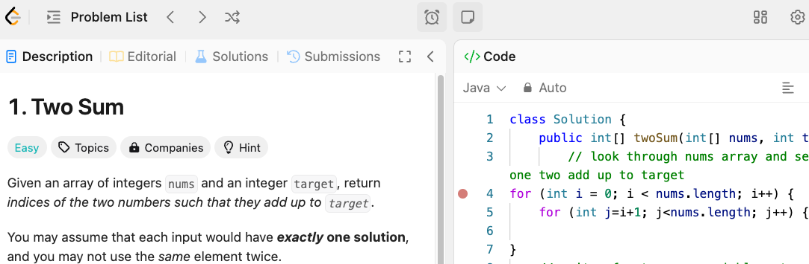

# Noob Algorithm Code Practice

---

# Introduction
In our transition period between bootcamp and our internalship phase, we did a month of primarily self-study on data structures and algorithms. This repository is a collection of my practice problems and solutions.

---

# Overview

The majority of the problems in this repository are from the LeetCode platform. I have also included a few problems from other platforms such as HackerRank. The problems are seperated into folders based on the platform they are from. The screenshot below is one of the first problems I attempted, a "sentimental" n00by souvenir. 

---

# Design
Each file in the repo is for a specific problem. I include a brief description of the problem, the solution, and any additional notes or comments. I was intentional about that design because of the way I like to learn.

Initially, when I started LeetCode, it was definitely a new muscle to flex, since in bootcamp, it was more about grasping coding concepts and syntax. In these whiteboard practices, it involves applying those concepts in a deeper level to problem-solve as well as grasp the tricky logic in the problem details. 

I found by including the scratchpad and my thought process, I was able to at least get a sense of the problem and how to approach it. Then, from there, I could think of what tools I wanted to use to solve it. While at first it was defeating when my answers would not work, I found that it was a great learning experience. As such, you may see some "solutions" I attempted that did not work along with explanation of why and my takeaway. 

In the end of each file, I list any other major takeaways or learnings. I also try to talk through some of the more complex ones in my whiteboarding videos [here](https://www.youtube.com/playlist?list=PL97VrtuAfZm8HHporK5EotFV5Re-Uo2xg), where I record myself re-attempting the problem and "teaching it back". 

